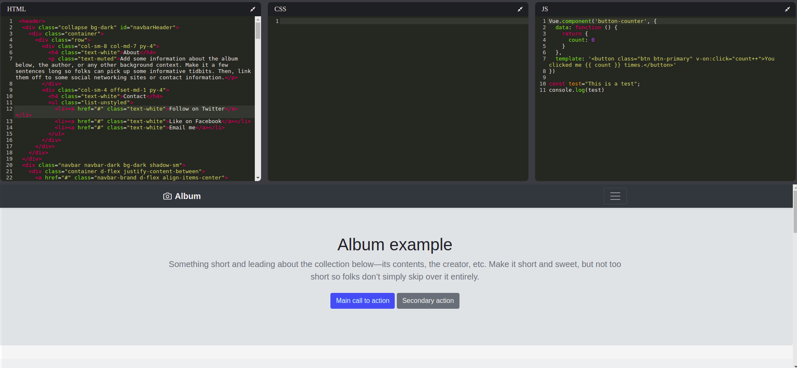
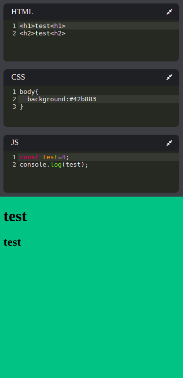

# VuePen

This is a clone of popular platform [Codepen](https://codepen.io/) with inspiration from [Web Dev Simplified](https://www.youtube.com/channel/UCFbNIlppjAuEX4znoulh0Cw) where this is built with React.  
Idea was to create this in Vue and show differences.

> Note: This is built with bundless Vue approach.

## Live Preview

https://vuepen-clone.netlify.app

## Tools

- [Vue @2.6.10](https://vuejs.org/)
- [Codemirror @5.58](https://codemirror.net/index.html)
- [Vue-codemirror @4.0.6](https://github.com/surmon-china/vue-codemirror)

## Screenshots

### Desktop

### Mobile

